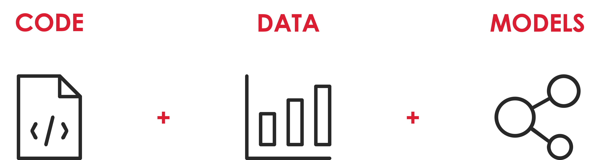
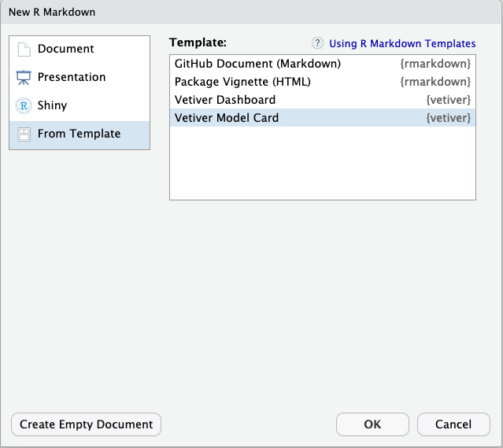

```{r setup, include=FALSE}
library(xaringan)
library(DT)
options(htmltools.dir.version = FALSE)
knitr::opts_chunk$set(echo = TRUE, dpi = 300, out.width="70%", fig.height=5, message=FALSE, warning=FALSE, fig.align = "center")
```
```{r xaringan-panelset, echo=FALSE}
xaringanExtra::use_panelset()
```
background-color: `r params$red`

.solita-logomark-starter[]
.solita-text[]


<br>
<br>
<br>
<br>
<br>
<br>
<br>
<br>


.header-large[MLOps i R]

# 

.header-small[Filip Wästberg]

???

Here you can add notes, if you want to access the notes: press "p" during the presentation. Keep in mind, you can add images, links, equations or whatever here. This is markdown aswell!

---


## MLOps är en kombination av kod, data och ML-modeller

```{r echo=FALSE, out.width="90%"}

```

---

## Data

```{r echo=FALSE, out.width="60%"}
library(tidyverse)
library(ggthemes)

tds9 <- read_csv("data/tds9.csv")

ggplot(tds9, aes(x = temperature, y = consumption)) +
    geom_point(aes(color = larm)) +
    geom_smooth(data = tds9, method = "gam") +
    scale_color_colorblind() +
    theme_minimal() +
    labs(
        title = "Prediciting consumption with outdoor temperature"
    )
```

---

```{r}
tds9_clean <- tds9 |> 
    mutate(date = as.Date(timestamp),
           across(consumption:temperature, ~round(., 3))) |> 
    select(date, consumption, temperature) 

tds9_clean |> 
    datatable()
```

---

## Pins

Ett paket med vilket vi kan publicera R/Python-objekt till en rad olika miljöer

- SharePoint
- OneDrive
- Azure
- AWS
- Google cloud
- Posit Connect (tidigare RStudio Connect)

... och fler.

---

```{r}
library(pins)

board <- board_temp()

board
```

---

Skriv dataset till en board:

```{r}
pin_write(
    board, tds9_clean, 
    "tds9_clean", 
    versioned = TRUE,
    description = "Data from distict heating metering point tds9.",
    metadata = list(source = "District heating company A")
)

pin_read(board, "tds9_clean") |> 
    head()
```

---

```{r}
pin_versions(board, "tds9_clean")
```

---

Lägg till lite ny data

```{r}
new_data <- tibble(
    date = as.Date("2020-10-22"),
    temperature = 8.154,
    consumption = 1.12
)

tds9_new_data <- bind_rows(new_data, tds9_clean)

tds9_new_data |> 
    head()
```

---

## Skriv en till version av data

```{r}
pin_write(board, tds9_new_data, "tds9_clean", versioned = TRUE)

pin_versions(board, "tds9_clean")
```


---

## Data drift

- Hur kan vi upptäcka data som driftar?

- Covariate Drift: Covariate drift is defined as Non-Intersection Distance between two distributions.

```{r}
dragons <- DALEX::dragons

glimpse(dragons)
```

---

```{r}
library(drifter)
dragons_test <- DALEX::dragons_test

d <- calculate_covariate_drift(dragons, dragons_test)
d
```

---

```{r}
dragons_test |> 
    ggplot(aes(x = year_of_discovery)) +
    geom_histogram()
```

---

```{r}
dragons |> 
    ggplot(aes(x = year_of_discovery)) +
    geom_histogram()
```

---

## MLOps - Data 

- Se till att versionshantera data (inte samma sak som att versionshantera kod)
- Ha koll på hur data förändras

---

## MLOps - Models

- Vi vill ha en tydlig förklaring av vad modellen gör och eventuella begränsningar

--

- Om vi har automatisk träning vill vi monitorera den

--

- Om modellen ger prediktioner vill vi se hur dessa preseterar mot ny data

---

## Model card

Ett dokument som förklarar modellen

- Detaljer om modellen, ex. en linjär regression

--

- Hur den ska användas, ex. Användas för att prognosticera fjärrvärmeanvändning

--

- Viktiga faktorer - Finns det demografiska eller tekniska faktorer som är av betydelse?

--

- Mått som används för att beskriva modellens prestanda

--

- Tränings- och utvärderingsdata, hur det valts 

--

- Kvantitativ analys, hur presterar modellen på träningsdata, hur presterar den på eventuella undergrupper? Finns det grupper där den presterar bättre eller sämre?

--

- Etisk hänsyn, finns det risker med modellen om den inte används korrekt m.m.

--

- Varningar och rekommendationer, finns det något som modellen kan eller inte kan göra? Exempelvis bygger modellen här på historisk temperatur, kan den då användas på väderprognoser?


---

## `vetiver` - MLOps i R

```{r}
library(vetiver)
library(pins)
library(mgcv)
board <- board_temp()
tds9_train <- filter(tds9_clean, date < "2020-08-01")
tds9_test <- filter(tds9_clean, date >= "2020-08-01")

pin_write(board, tds9_test, "tds9_test")

dh_gam <- gam(consumption ~ s(temperature), data = tds9_train)

v <- vetiver_model(dh_gam, "dh_gam", description = "A generalized addative model")

vetiver_pin_write(board, v, "dh_gam")

v
```

---

## Model card

```{r echo=FALSE}

```

---

## Bevaka omträning om modell

- Vi har ett flöde som läser data och tränar om modellen

---

Ta fram metrics för träningsdata

```{r}
tds9_metrics <- augment(dh_gam, new_data = tds9_train) %>%
    mutate(date = tds9_train$date) |> 
    vetiver_compute_metrics(date, period = "month", truth = consumption, 
                            estimate = .fitted, every = 4L)
```

- Samma princip kan användas för att bevaka ny data som kommer in

---

Visualisera metrics

```{r}
vetiver::vetiver_plot_metrics(tds9_metrics)
```

