```{r setup, include=FALSE}
library(xaringan)
library(DT)
options(htmltools.dir.version = FALSE)
knitr::opts_chunk$set(echo = TRUE, dpi = 300, out.width="70%", fig.height=5, message=FALSE, warning=FALSE, fig.align = "center")
```
```{r xaringan-panelset, echo=FALSE}
xaringanExtra::use_panelset()
```
background-color: `r params$red`

.solita-logomark-starter[]
.solita-text[]


<br>
<br>
<br>
<br>
<br>
<br>
<br>
<br>


.header-large[MLOps in R]

# 

.header-small[Filip Wästberg, Data Scientist at Solita]
<br>
.header-small[Stockholm R User Group (SRUG)]

???

Here you can add notes, if you want to access the notes: press "p" during the presentation. Keep in mind, you can add images, links, equations or whatever here. This is markdown aswell!

---

## Welcome to the SRUG!

```{r echo=FALSE}
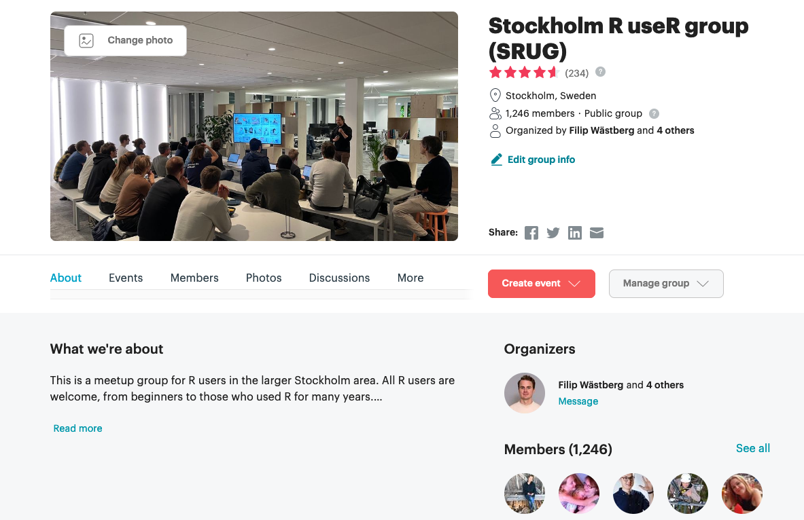
```

---

## Who am I?

.pull-left[

Filip Wästberg
<br>
<br>
```{r echo=FALSE, out.width="50%"}

```
]

.pull-right[

- Data Scientist at Solita

- Worked mainly in R the last 6 years 

- Love maps, check out my package [github.com/filipwastberg/swemaps2](https://github.com/filipwastberg/swemaps2)

- One of the organizers of SRUG

]

---

```{r echo=FALSE, out.width="108.5%"}
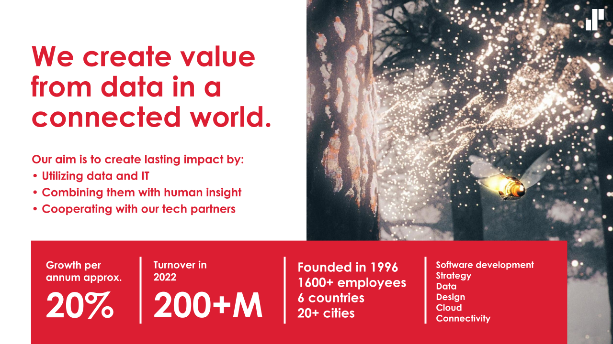
```

---

### Solita is a Full Service Partner to Posit (previously RStudio)


```{r echo=FALSE}
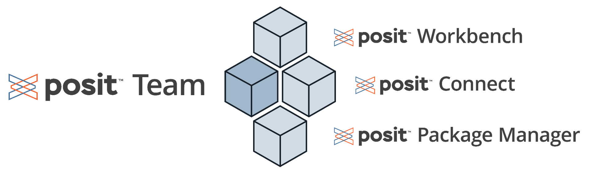
```


```{r echo=FALSE, out.width="40%"}
knitr::include_graphics("img/RStudio-Logo-Flat.png")
```

---

```{r echo=FALSE}
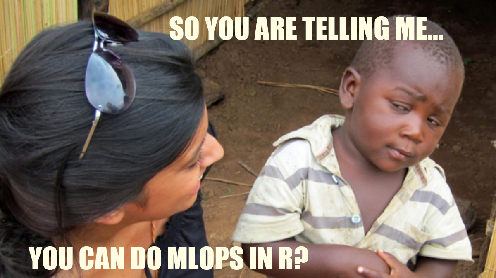
```


---

## Agenda

- What is MLOps? (consultant buzzword slides)

--

- Packages for MLOps in R

--

- MLOps in R in a real world use case

---

## What is Machine Learning?

- In the context of MLOps, every statistical model that learns from data to produce predictions

```{r echo=FALSE}
#tds9_no_larm_clean <- tds9 |> 
#    filter(!larm) |> 
#    mutate(date = as.Date(timestamp)) |> 
#    select(date, temperature, consumption)
#
#write_csv(tds9_no_larm_clean, "data/tds9_no_larm.csv")
```


```{r echo=FALSE, out.width="60%"}
library(tidyverse)

tds9 <- read_csv("data/tds9_no_larm.csv")

ggplot(tds9, aes(x = temperature, y = consumption)) +
    geom_point() +
    geom_smooth(method = "gam") +
    theme_minimal() +
    labs(
        title = "Prediciting consumption with outdoor temperature"
    )
```

---

```{r}
library(mgcv)

tds9_training <- filter(tds9, date < "2020-01-01")
tds9_test <- filter(tds9, date >= "2020-01-01")

gam_tds <- gam(
    consumption ~ s(temperature),
    method = "REML",
    data = tds9_training
    )

predict(gam_tds, tibble(temperature = -2))
```


---
background-color: `r params$black`

<br>
<br>
<br>

.header-small[There are amazing tools for building models in R, but not as many for getting models into production]

---

## Building a model is easy

Scaling Data Science is hard
<br>
<br>
<br>
```{r echo=FALSE}
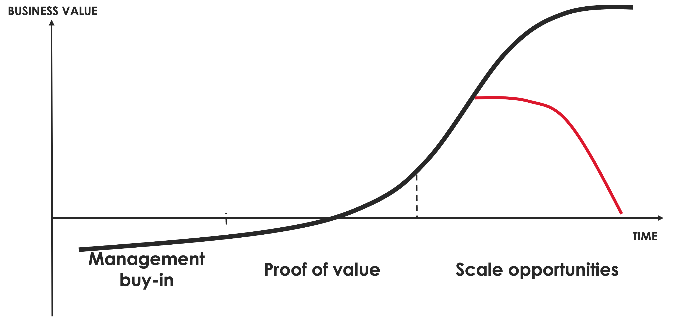
```

---

## Two modes of Data Science

.pull-left[
.center[
### The Lab

```{r echo=FALSE, out.width="60%"}
knitr::include_graphics("img/flask_lab_medical_medicine_experimental.svg")
```

]
]

.pull-right[
.center[
### The Factory

```{r echo=FALSE, out.width="60%"}
knitr::include_graphics("img/industry_building_factory_work_business.svg")
```
]
]

---

## Why do we need MLOps?

- Free up time for new use cases

--

- Speed up time to delivery

--

- Ensure that our models, and the assumptions we have made, hold over time

---

## With great powers comes great responsibility

```{r echo=FALSE, out.width="70%"}
knitr::include_graphics("img/mlops-value.png")
```

---

## What is MLOps?

```{r echo=FALSE, out.width="90%"}
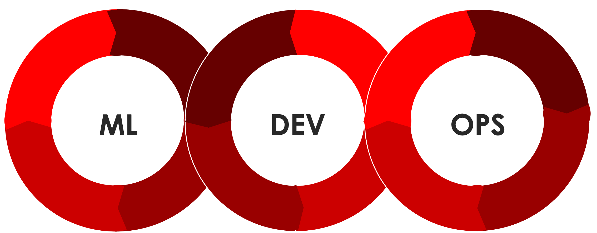
```

---

## Practically, what is MLOps?

MLOps is a combination of code, data and models

```{r echo=FALSE, out.width="90%"}
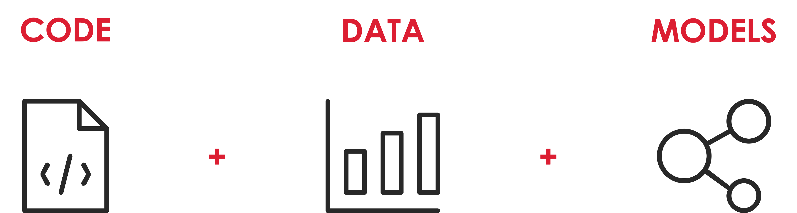
```

---

## The model lifecycle

```{r echo=FALSE, out.width="90%"}
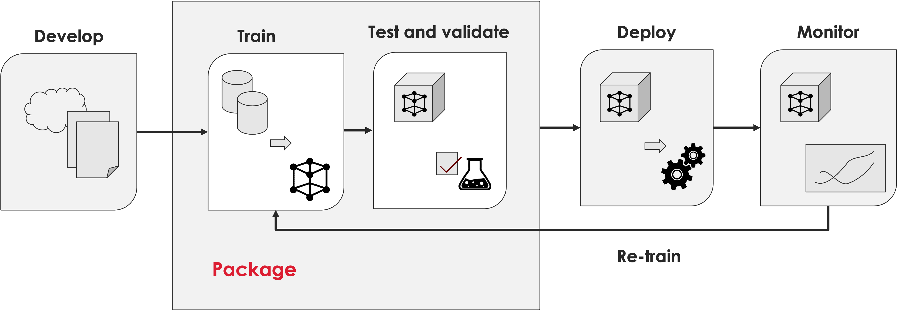
```

---

## How do we manage the model?

- Code
- Data
- Model

```{r}
gam_tds
```

---

## Code

- Write code that is easy to read

--

- Write DRY code (Don't Repeat Yourself)

--

- Use SOME folder structure 

```
my_ml_project/
--- /R
--- /data-raw
--- /data
--- /Rmd
--- README.Rmd
```

--

- Use version control

```{r echo=FALSE, out.width="100px"}
knitr::include_graphics("img/git-logo.png")
```

---

## Git

```{r echo=FALSE}
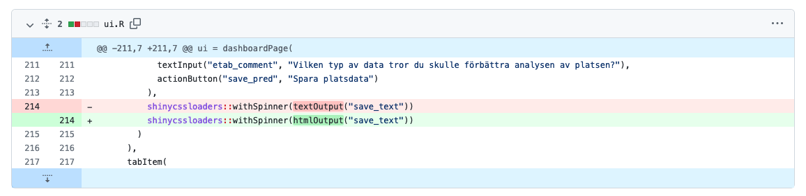
```

---

## MLOps: Data

In the end we have a data.frame in R 

```{r}
tds9_training |> 
    head()
```

---

## Things we want to keep track of:

- How does the underlying data in our model change?

--

- In some cases we need historic data for regulations

---

## Data

How do we version data?

```{r echo=FALSE, out.width = "200px"}

```

---

## Pins let you write R or Python objects 

- SharePoint
- OneDrive
- NFS
- Azure
- AWS
- Google cloud
- Posit Connect (previously RStudio Connect)

---

## Create a board

```{r}
library(pins)

temp_board <- board_temp()

temp_board
```

--

Example of other boards:

- board_rsconnect()
- board_azure()
- board_ms365()
- board_s3()
- board_local()

---

#### Write a pin

```{r}
pin_write(
    board = temp_board,
    x = tds9_training, 
    name = "tds9_training", 
    versioned = TRUE, ## Turn on versioning
    description = "Data from distict heating metering point tds9.",
    metadata = list(source = "District heating company A")
)

pin_list(temp_board)
```

--

Each pin gets a version:

```{r}
pin_versions(temp_board, "tds9_training")
```

---

## Reading a pin

```{r}
tds9_train_pin <- pin_read(temp_board, "tds9_training")
 
glimpse(tds9_train_pin)
```

---

## There is more data!

```{r echo=FALSE}
#future_tds9 <- tds9_clean |> 
#    filter(between(date, as.Date("2019-10-23"), as.Date("2020-01-01"))) |> 
#    mutate(date = date + 365,
#           consumption = consumption + rnorm(nrow(future_tds9), mean = 1, sd = 0.1),
#           temperature = temperature + rnorm(nrow(future_tds9), mean = 1, sd = 0.1)) 
#
#write_csv(future_tds9, "data/future_tds9")
```
```{r}
future_tds9 <- read_csv("data/future_tds9.csv")

tds9_training <- bind_rows(tds9_training, future_tds9)
```

--

```{r}
pin_write(
    board = temp_board,
    x = tds9_training, 
    name = "tds9_training", 
    versioned = TRUE
)

pin_versions(temp_board, "tds9_training")
```

---

## Caveat for Pins

- Works great for small datasets

--

- Not ideal for large datasets

--

- If data > 500mb you should probably use a database instead

--

- Check out our last Meetup: Three strategies to Tackle Big Data in R 

---

## MLOps: Models

- Deploy model

- Monitor model

---

## Vetiver

The goal of vetiver is to provide fluent tooling to version, deploy, and monitor a trained model. Functions handle both recording and checking the model’s input data prototype, and predicting from a remote API endpoint.

```{r echo=FALSE, out.width = "300px"}
knitr::include_graphics("img/vetiver.png")
```

---

```{r echo=FALSE, out.width = "1000px"}
knitr::include_graphics("img/ml_ops_cycle.png")
```

---

## Vetiver

Vetiver supports the most common ml libraries:

- caret
- ml3
- tidymodels
- mgcv 
- xgboost
- `lm()` and `glm()`

--

```{r}
library(vetiver)

v_gam <- vetiver_model(gam_tds, "gam_tds9", versioned = TRUE)

v_gam
```

---

## Write model as pin

```{r}
vetiver_pin_write(
    board = temp_board, 
    vetiver_model = v_gam
    )

pin_versions(temp_board, "gam_tds9")
```

---

## Deployment

Two common patterns:

- Batch predictions

--

- Deploy model as an API

---

## Batch predictions 

- Schedule a script or a RMarkdown somewhere

- Write the data to where it should be

- Think about your environment

```{r echo=FALSE, out.width = "100px"}
knitr::include_graphics("img/renv.svg")
```

---

## Deploy model as an API

- Application programming interface

- Run: http://server:8000/plot and get a plot

```{r echo=FALSE, out.width = "300px"}

```

---

In a `plumber.R` file:

```{r eval=FALSE}
#* Plot a histogram
#* @serializer png
#* @get /plot
function() {
  rand <- rnorm(100)
  hist(rand)
}
```


---

```{r eval=FALSE}
library(plumber)
pr("plumber.R") %>%
  pr_run(port = 8000)
```

```{r echo=FALSE, out.width = "600px"}
knitr::include_graphics("img/plumber-ex.png")
```

---

## If you have a vetiver model

- `vetiver_write_plumber` writes the plumber file for you

```{r eval=FALSE}
vetiver_write_plumber(temp_board, "gam_tds9")
```

--
```
# Generated by the vetiver package; edit with care

library(pins)
library(plumber)
library(rapidoc)
library(vetiver)
b <- board_folder(path = "/var/folders/pn/9hhpnpd15_d2k3qp5k814nnh0000gq/T/Rtmpnh1uLR/pins-73b625952e3f")
v <- vetiver_pin_read(b, "gam_tds9")

#* @plumber
function(pr) {
    pr %>% vetiver_api(v)
}
```

---

## Query the API

```
curl -X POST "http://127.0.0.1:8000/predict" \
 -H "Accept: application/json" \
 -H "Content-Type: application/json" \
 -d '[{"temperature":5}]'
```

Result: 

```
{".pred":[1.4402]}%
```

---

## We want to deploy the API

Using Docker and a cloud platform or own server:

```
vetiver_write_docker(
    vetiver_model,
    plumber_file = "plumber.R",
    path = ".",
    lockfile = "vetiver_renv.lock",
    rspm = TRUE
)
```

--

Using RStudio/Posit Connect

```
vetiver_deploy_rsconnect(
    board = rsconnect_board,
    name,
    version
)
```

---

## Monitoring the model

- If we have automatic retraining we want to monitor the training pipeline

- Keep track of predictions from the model and how they perform 

---

## Using Vetiver to track performance

```{r}
tds9_test |> 
    mutate(.pred = predict(gam_tds, tds9_test)) |> 
    vetiver_compute_metrics(
        date_var = date,
        period = "year",
        truth = consumption,
        estimate = .pred
        )
```


---

## Vetiver model monitoring

```{r}
future_metrics <- future_tds9 |> 
    mutate(.pred = predict(gam_tds, future_tds9)) |> 
    vetiver_compute_metrics(
        date_var = date,
        period = "week",
        truth = consumption,
        estimate = .pred
        )
```

---

```{r}
vetiver_plot_metrics(future_metrics)
```

---

## The model card

.pull-left[


For transparent and responsible ML

The model card outlines:

- Model details
- Intended use and how to use it
- Important aspects/factors
- Performance metrics
- Training data & evaluation data
- Quantitative analyses
- Ethical considerations
- Caveats & recommendations

]

.pull-right[

```{r echo=FALSE}
knitr::include_graphics("img/vetiver-templates.png")
```

]

---

## Model cards as a model repository

```{r echo=FALSE, out.width="700px"}
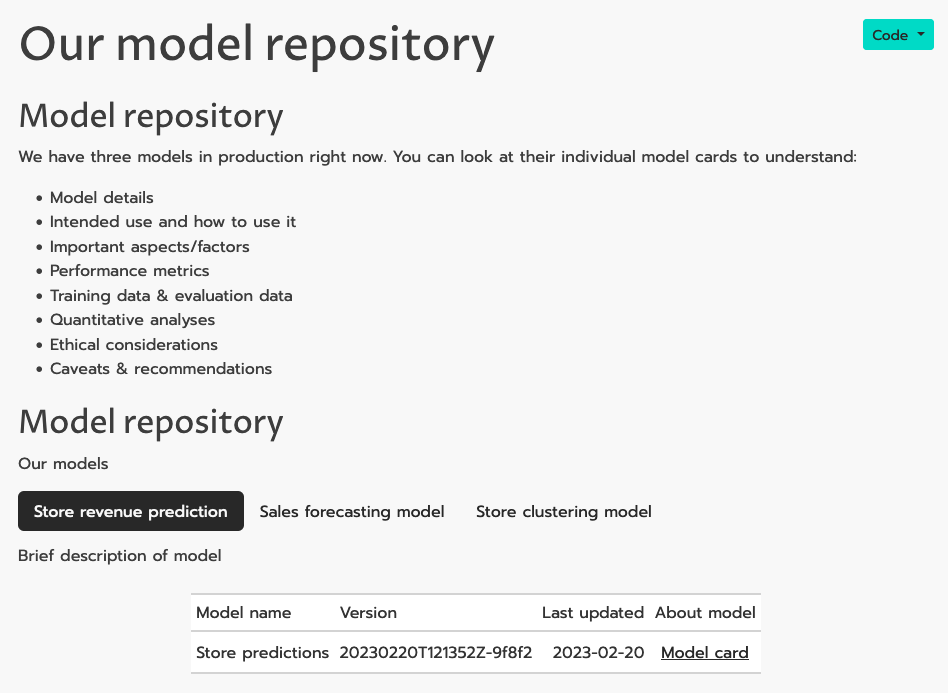
```

---

## What other packages are there for MLOps?

--

- `mlflow`, great support for Python, exeperiment tracking, stable R API, connections and templates to Docker, Azure, AWS

--

- `azureml` has a R API

--

- `vertex AI` (prev. Google AI) has support for `plumber` 

---

## How does it work in the real world?

--

### Use case presentation

A large retail company

- Wanted to investigate if they should differentiate stores based on their location

--

- Using cluster analysis based on Google Maps data, public transport data and their own sales data we identified different segments of stores

--

- We also built a model to pin point stores that sold less than expected in certain categories

---

## Where should we open new stores?

The head of establishment saw the analysis: 

>> Cool, what if we could have a map that I could click on, see what places there are around and use the same model to estimated revenue of a new store?

```{r echo=FALSE, out.width = "200px"}
knitr::include_graphics("img/character39.png")
```

---

## Let's do it

```{r echo=FALSE}

```

---

## What is Shiny?

- "Shiny combines the computational power of R with the interactivity of the modern web."

```{r echo=FALSE, out.width = "400px"}

```

---

## In a week

```{r echo=FALSE}
knitr::include_graphics("img/reitablish.png")
```

---

## MLOps: Data 

Data from many different sources

```{r, echo=FALSE,out.width="20%", out.height="10%",fig.show='hold',fig.align='center', fig.cap="Data sources"}
knitr::include_graphics(c("img/dbt-logo.png", "img/google_bigquery.png", "img/google-maps.png", "img/trafikverket.png"))
```

- Used database and `dbt` to manage data 

---

## MLOps: Models

Deployment: Vetiver Model on RStudio/Posit Connect

```{r echo=FALSE}
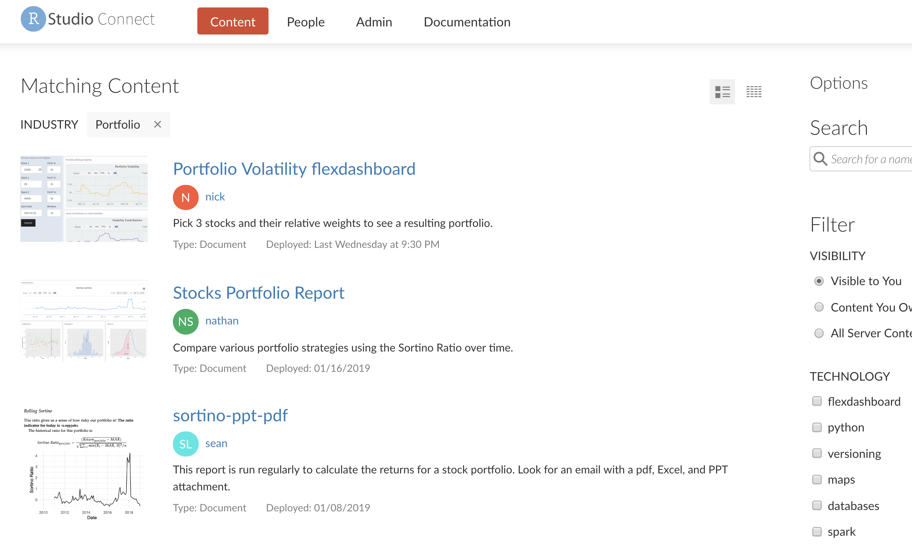
```

---

## Pins + Vetiver

- To version data we used `pins` and `vetiver`

--

- The model was a `vetiver` pin on Connect

--

- Calculated metrics with `vetiver` and stored as pin + database

---

## Using Shiny to keep track of model performance

--

- The shiny app gives estimates of revenue for a new store 

--

- They are always going to be wrong

--

- So we also let users give their own estimates 

--

- Let us keep track of model predictions vs human gut feeling

--

- In the future we might use the manual estimates in the training 

---

## MLOps in R

```{r echo=FALSE, out.width="1000px"}
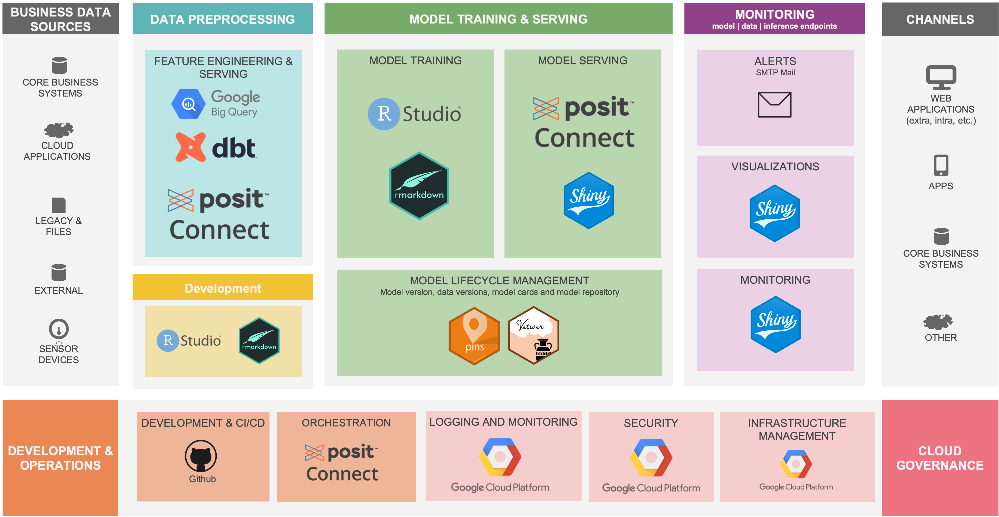
```

---

## MLOps in R without Connect

```{r echo=FALSE, out.width="1000px"}
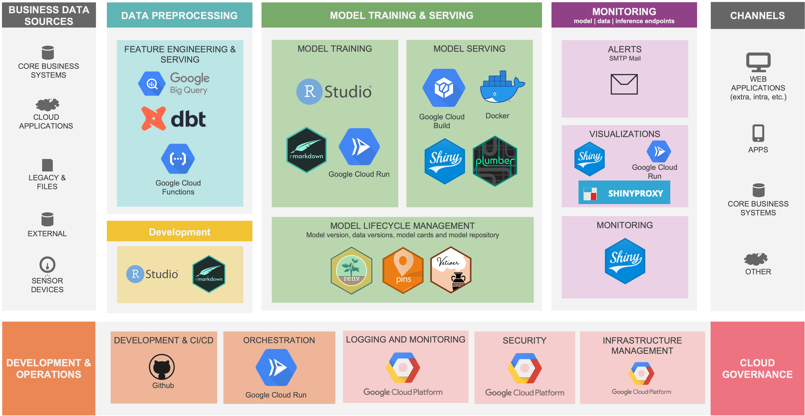
```

---

## Summary

--

- The support for the three core components of MLOPs is maturing in R

--

- It is very important to have good support and interest from DevOps/IT. If not, third party tools like Posit Connect can be very helpful. 

--

- Shiny really is amazing 


